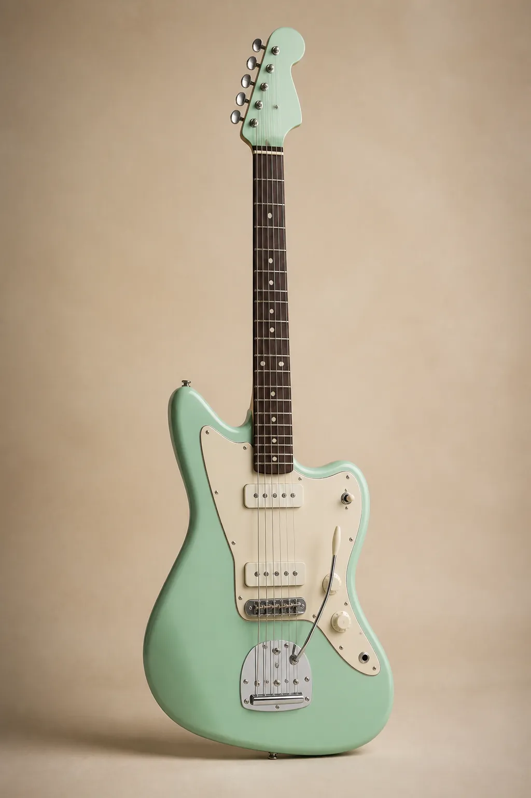

<div align="center">

# A&A GUITAR STORE

### 音を選ぶ。自分を奏でる。

ギターを選ぶ時間そのものが楽しくなるように設計した、ギター専門ECサイトのポートフォリオです。




</div>

> [!IMPORTANT]
> このサイトは制作実績として作成したデモです。実際の注文、決済、本人確認、商品の発送は行われません。

## このプロジェクトについて

A&A GUITAR STOREは、「初めてギターを選ぶ人にも分かりやすく、経験者にも比較しやすいショップ」を目指して制作しました。

商品を並べるだけではなく、検索から比較、カート、支払い方法の確認、注文履歴まで、オンラインショップで必要になる一連の体験を実装しています。落ち着いた色合いと余白を生かし、楽器店らしい温かさと上質さが伝わるデザインに仕上げました。

## 主な機能

| 機能 | 内容 |
| --- | --- |
| 商品コレクション | エレキ、アコースティック、クラシック、セミホロウ、ベースを掲載 |
| 検索・絞り込み | 商品名や特徴による検索、種類別フィルター、価格順、セール商品の表示 |
| お気に入り | 気になる商品を保存し、お気に入りだけに絞って表示 |
| 商品比較 | 最大3本の価格、素材、保証期間を並べて比較 |
| 商品詳細 | 拡大写真、在庫、素材、重量、スケール、製造国、レビューを表示 |
| 関連商品 | 弦、ケース、チューナー、アンプ、ケーブル、お手入れ用品などを掲載 |
| ショッピングバッグ | 数量変更、削除、合計金額、購入特典までの進捗を確認 |
| デモ注文 | 事前決済、代金引換、請求書後払いを想定した注文フロー |
| 注文履歴 | この端末内に保存されたデモ注文を確認・再注文 |
| 多言語表示 | 日本語と英語を切り替え、ページを移動しても選択を維持 |
| レスポンシブ対応 | PC、タブレット、スマートフォンに合わせてレイアウトを最適化 |

## 制作で大切にしたこと

### 安心して試せるデモ設計

ポートフォリオであることを画面上部と注文画面に明示しています。住所、カード情報、本人確認書類は入力・送信できない設計にし、実際の取引が発生しないことが分かるようにしました。

### 商品選びを助ける情報設計

ギターの種類によって保証期間を変え、比較表や商品仕様、関連商品を用意しました。購入特典も「あといくら・あと何本」で条件を確認できるため、次の行動が分かりやすくなっています。

### 写真の品質と表示速度の両立

各商品に異なる写真を用意し、拡大表示にも対応しました。29枚の画像はWebPへ変換し、合計容量を約47.55MBから約1.57MBまで削減しています。必要な画像だけを遅延読み込みすることで、商品数が多くても軽快に閲覧できるようにしています。

## 使用技術

- Next.js 14（App Router）
- React 18
- TypeScript
- CSS Modules
- Local Storage（カート、お気に入り、比較、言語、デモ注文履歴）
- Next.js Image

外部の決済サービス、データベース、認証サービスは使用していません。すべての注文情報はデモデータとしてブラウザ内だけで扱います。

## ローカルでの起動方法

```bash
git clone https://github.com/w25001-ux/Order-project.git
cd Order-project/order-app
npm install
npm run dev
```

ブラウザで [http://localhost:3000](http://localhost:3000) を開いてください。

公開版と同じ条件で確認する場合は、次のコマンドを使用します。

```bash
npm run build
npm run start
```

## プロジェクト構成

```text
Order-project/
├─ README.md
└─ order-app/
   ├─ app/
   │  ├─ checkout/       # デモ注文画面
   │  ├─ confirm/[id]/   # 注文確認画面
   │  ├─ history/        # デモ注文履歴
   │  ├─ layout.tsx
   │  └─ page.tsx        # ショップのメイン画面
   ├─ public/            # 軽量化した商品画像
   └─ package.json
```

## 品質確認

以下の確認を行っています。

- TypeScriptの型チェック
- ESLintによるコード検査
- Next.jsの本番ビルド
- PC・小さい画面での表示確認
- 商品検索、お気に入り、比較、カート、注文履歴の操作確認
- 日本語・英語のページ間引き継ぎ
- 画像切れと横方向の表示崩れの確認

## 今後について

現在はポートフォリオ用のフロントエンドとして完成しています。実際のECサイトとして運用する場合は、認証、商品データベース、在庫管理、管理画面、決済サービス、注文メールなどを追加する想定です。

---

<div align="center">

Built with care for people who love guitars.

</div>
